# Diagramas UML - Proyecto PropTech (Insignia Inmo)

> Documento con todos los diagramas de clases del proyecto, incluyendo código PlantUML listo para copiar a herramientas como PlantUML Online, VS Code (plugin), draw.io, etc.

---

## Índice de Diagramas

1. [Diagrama General de Paquetes](#1-diagrama-general-de-paquetes)
2. [Estructuras de Datos](#2-estructuras-de-datos)
3. [Capa Modelo](#3-capa-modelo)
4. [Capa DAO](#4-capa-dao)
5. [Capa Servicio](#5-capa-servicio)
6. [Main + Utilidades](#6-main--utilidades)
7. [Diagrama de Relaciones Completo](#7-diagrama-de-relaciones-completo)

---

## 1. Diagrama General de Paquetes

```
com.proptech
├── (Main.java)
├── modelo          → 8 clases (POJOs)
├── dao             → 8 clases (SQLite)
├── servicio        → 13 clases (negocio)
└── utilidades
    ├── HashUtils.java
    └── estructuras → 12 clases (EDs)
```

```plantuml
@startuml Paquetes
package "com.proptech" {
  class Main
  package "modelo" {
    [Alerta] [Asesor] [Cliente] [Inmueble]
    [Operacion] [Rol] [Usuario] [Visita]
  }
  package "dao" {
    [ConexionDB] [InmuebleDAO] [ClienteDAO] [AsesorDAO]
    [UsuarioDAO] [OperacionDAO] [VisitaDAO] [FavoritoDAO]
  }
  package "servicio" {
    [InventarioInmueblesService] [ClientesService] [AuthService]
    [OperacionesService] [VisitaService] [AlertasService]
    [GestorVisitasService] [RecomendacionService]
    [AnalisisRelacionesService] [HistorialCambiosService]
    [HistorialYFavoritosService] [DetectorAnomaliesService]
    [ReporteService]
  }
  package "utilidades.estructuras" {
    [Nodo] [ListaEnlazada] [Pila] [Cola]
    [NodoPrioridad] [ColaPrioridad] [NodoArbol]
    [ArbolBinarioBusqueda] [EntradaHash] [TablaHash]
    [Vertice] [Grafo]
  }
  package "utilidades" {
    [HashUtils]
  }
}

Main --> "modelo" : usa
Main --> "servicio" : usa
Main --> "dao" : usa
Main --> "utilidades" : usa
"servicio" --> "modelo" : manipula
"servicio" --> "utilidades.estructuras" : implementa
"servicio" --> "dao" : persiste
"dao" --> "modelo" : mapea
"dao" --> ConexionDB
@enduml
```

---

## 2. Estructuras de Datos

Todas las estructuras son **genéricas** y se implementaron desde cero.

### 2.1 Nodo y ListaEnlazada

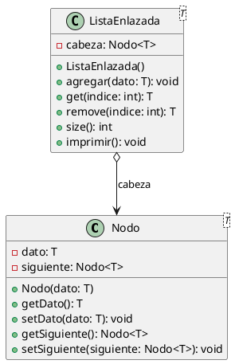

### 2.2 Pila

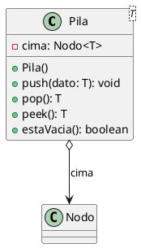

### 2.3 Cola

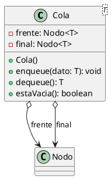

### 2.4 ColaPrioridad

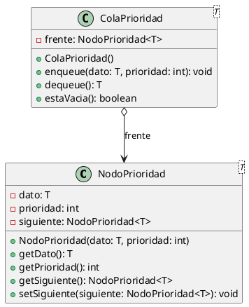

### 2.5 ArbolBinarioBusqueda

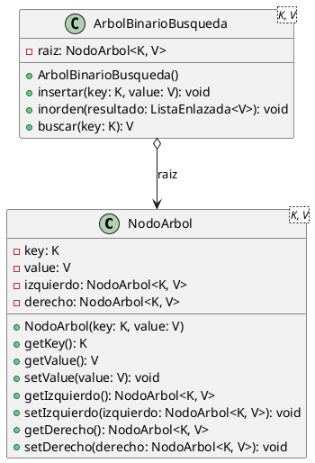

### 2.6 TablaHash

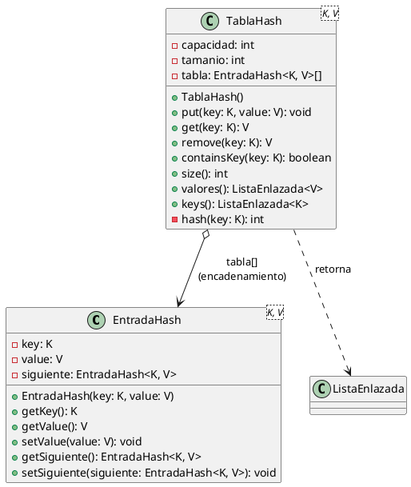

### 2.7 Grafo

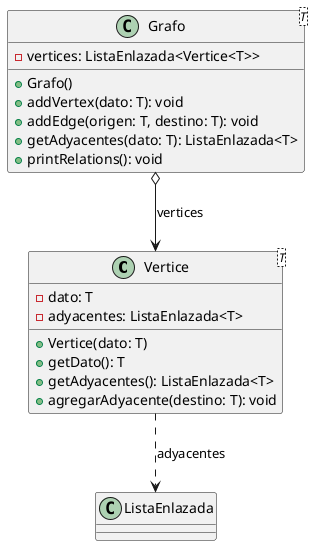

---

## 3. Capa Modelo

### 3.1 Inmueble

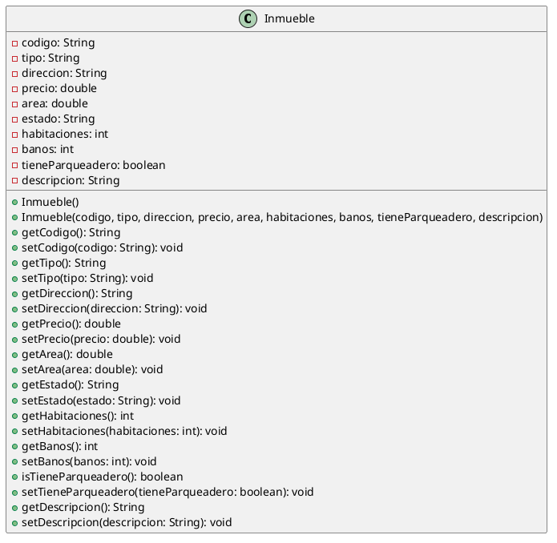

### 3.2 Cliente

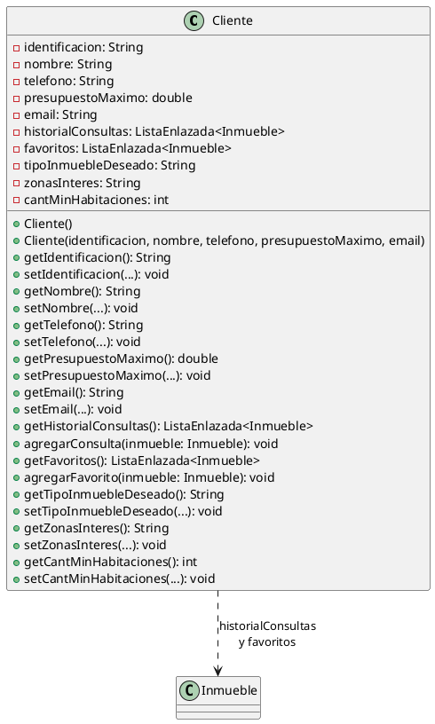

### 3.3 Asesor

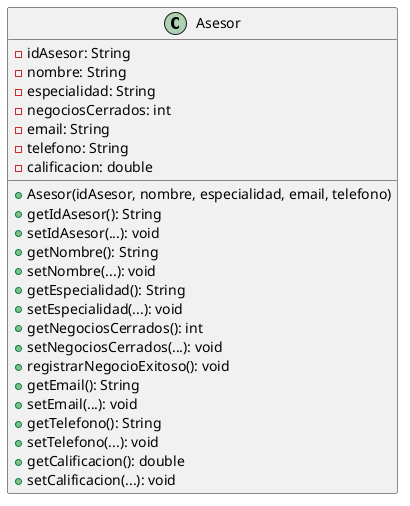

### 3.4 Visita

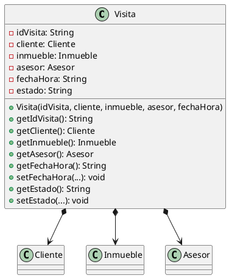

### 3.5 Operacion

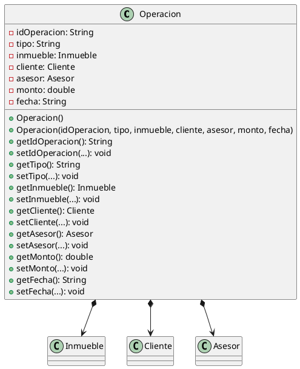

### 3.6 Alerta

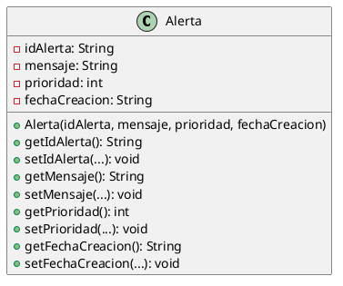

### 3.7 Rol

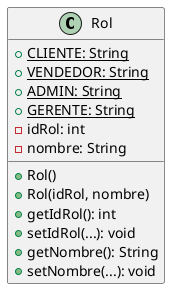

### 3.8 Usuario

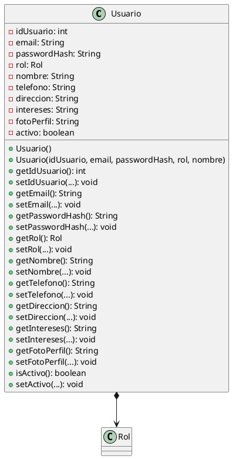

### 3.9 Modelo - Diagrama de Relaciones Completo

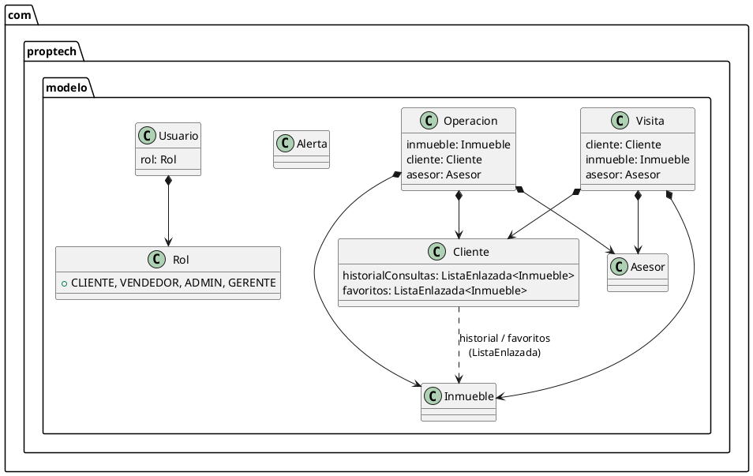

---

## 4. Capa DAO

### 4.1 ConexionDB

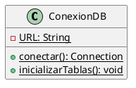

### 4.2 InmuebleDAO

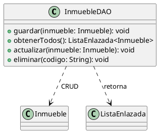

### 4.3 ClienteDAO

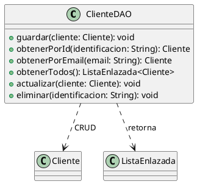

### 4.4 AsesorDAO

```plantuml
@startuml AsesorDAO
class AsesorDAO {
  + guardar(asesor: Asesor): void
  + obtenerPorId(idAsesor: String): Asesor
  + obtenerTodos(): ListaEnlazada<Asesor>
  + actualizar(asesor: Asesor): void
  + eliminar(idAsesor: String): void
}

AsesorDAO ..> Asesor : CRUD
AsesorDAO ..> ListaEnlazada : retorna
@enduml
```

### 4.5 UsuarioDAO

```plantuml
@startuml UsuarioDAO
class UsuarioDAO {
  - cacheUsuarios: ConcurrentHashMap<String, Usuario>
  - cacheRoles: ConcurrentHashMap<String, Rol>
  + UsuarioDAO()
  + UsuarioDAO(forzarRecarga: boolean)
  + crear(email, passwordHash, nombre, nombreRol): Usuario
  + actualizar(usuario: Usuario): boolean
  + buscarPorEmail(email: String): Usuario
  + obtenerTodos(): ListaEnlazada<Usuario>
  + obtenerRolPorNombre(nombre: String): Rol
  - inicializarBaseDatosYRoles(): void
  - cargarUsuariosDesdeSQL(): void
  - cargarRolesDesdeSQL(): void
}

UsuarioDAO ..> Usuario : CRUD + cache
UsuarioDAO ..> Rol : consulta
UsuarioDAO ..> ConexionDB : JDBC
@enduml
```

### 4.6 OperacionDAO

```plantuml
@startuml OperacionDAO
class OperacionDAO {
  + guardar(operacion: Operacion): void
  + obtenerPorId(idOperacion: String): Operacion
  + obtenerTodas(): ListaEnlazada<Operacion>
  + obtenerPorTipo(tipo: String): ListaEnlazada<Operacion>
  + obtenerPorAsesor(idAsesor: String): ListaEnlazada<Operacion>
  + obtenerOperacionesPorCliente(idCliente: String): ListaEnlazada<Operacion>
  + actualizar(operacion: Operacion): void
  + eliminar(idOperacion: String): void
}

OperacionDAO ..> Operacion : CRUD
OperacionDAO ..> ConexionDB : JDBC
@enduml
```

### 4.7 VisitaDAO

```plantuml
@startuml VisitaDAO
class VisitaDAO {
  + guardar(visita: Visita): void
  + obtenerPorId(idVisita: String): Visita
  + obtenerTodas(): ListaEnlazada<Visita>
  + obtenerVisitasPorCliente(identificacionCliente: String): ListaEnlazada<Visita>
  + obtenerVisitasPorAsesor(idAsesor: String): ListaEnlazada<Visita>
  + actualizar(visita: Visita): void
  + eliminar(idVisita: String): void
}

VisitaDAO ..> Visita : CRUD
VisitaDAO ..> ConexionDB : JDBC
@enduml
```

### 4.8 FavoritoDAO

```plantuml
@startuml FavoritoDAO
class FavoritoDAO {
  + agregarFavorito(identificacionCliente: String, codigoInmueble: String): void
  + quitarFavorito(identificacionCliente: String, codigoInmueble: String): void
  + obtenerFavoritos(identificacionCliente: String): ListaEnlazada<String>
  + esFavorito(identificacionCliente: String, codigoInmueble: String): boolean
}

FavoritoDAO ..> ConexionDB : JDBC
@enduml
```

---

## 5. Capa Servicio

### 5.1 InventarioInmueblesService

```plantuml
@startuml InventarioInmueblesService
class InventarioInmueblesService {
  - inventario: TablaHash<String, Inmueble>
  - arbolPrecios: ArbolBinarioBusqueda<Double, Inmueble>
  + InventarioInmueblesService()
  + agregarInmueble(inmueble: Inmueble): void
  + buscarPorCodigo(codigo: String): Inmueble
  + obtenerOrdenadosPorPrecio(): ListaEnlazada<Inmueble>
  + obtenerTodos(): ListaEnlazada<Inmueble>
  + eliminarInmueble(codigo: String): void
}

InventarioInmueblesService *--> TablaHash
InventarioInmueblesService *--> ArbolBinarioBusqueda
InventarioInmueblesService ..> Inmueble
@enduml
```

### 5.2 ClientesService

```plantuml
@startuml ClientesService
class ClientesService {
  - clientes: TablaHash<String, Cliente>
  + ClientesService()
  + agregarCliente(cliente: Cliente): void
  + buscarPorId(identificacion: String): Cliente
  + obtenerTodos(): ListaEnlazada<Cliente>
  + actualizar(cliente: Cliente): void
}

ClientesService *--> TablaHash
ClientesService ..> Cliente
@enduml
```

### 5.3 AuthService

```plantuml
@startuml AuthService
class AuthService {
  - usuarioDAO: UsuarioDAO
  - recomendacionService: RecomendacionService
  + AuthService(usuarioDAO, recomendacionService)
  + registrar(email, password, nombre, telefono): Map<String, Object>
  + autenticar(email, password): Usuario
  + crearAdmin(): void
  + simularEnvioRecomendaciones(email: String): ListaEnlazada<Map<String, Object>>
}

AuthService --> UsuarioDAO
AuthService --> RecomendacionService
AuthService ..> HashUtils : SHA-256
@enduml
```

### 5.4 OperacionesService

```plantuml
@startuml OperacionesService
class OperacionesService {
  - operaciones: TablaHash<String, Operacion>
  - historialOperaciones: ListaEnlazada<Operacion>
  + OperacionesService()
  + registrarOperacion(operacion: Operacion): void
  + buscarPorId(idOperacion: String): Operacion
  + obtenerHistorial(): ListaEnlazada<Operacion>
  + obtenerPorTipo(tipo: String): ListaEnlazada<Operacion>
  + cancelarOperacion(idOperacion: String): void
}

OperacionesService *--> TablaHash
OperacionesService *--> ListaEnlazada
OperacionesService ..> Operacion
@enduml
```

### 5.5 VisitaService

```plantuml
@startuml VisitaService
class VisitaService {
  - visitas: TablaHash<String, Visita>
  - visitaDAO: VisitaDAO
  + VisitaService(visitaDAO)
  + agendarVisita(visita: Visita, clienteDAO, inmuebleService): Visita
  + confirmarVisita(idVisita: String): void
  + realizarVisita(idVisita: String): void
  + cancelarVisita(idVisita: String): void
  + obtenerVisitasPorCliente(email: String): ListaEnlazada<Map<String, Object>>
  + obtenerVisitasPorAsesor(idAsesor: String): ListaEnlazada<Map<String, Object>>
  + tieneConflictoHorario(idAsesor: String, fechaHora: String): boolean
}

VisitaService *--> TablaHash
VisitaService --> VisitaDAO
VisitaService ..> Visita
@enduml
```

### 5.6 AlertasService

```plantuml
@startuml AlertasService
class AlertasService {
  - colaAlertas: ColaPrioridad<Alerta>
  + AlertasService()
  + generarAlertas(inventario, operaciones, visitas, clientes): void
  + siguienteAlerta(): Alerta
  + encolarAlerta(mensaje, prioridad): void
}

AlertasService *--> ColaPrioridad
AlertasService ..> Alerta
@enduml
```

### 5.7 GestorVisitasService

```plantuml
@startuml GestorVisitasService
class GestorVisitasService {
  - colaVisitas: ColaPrioridad<Visita>
  + GestorVisitasService()
  + encolarVisita(visita: Visita, prioridad: int): void
  + desencolarVisita(): Visita
  + obtenerSiguiente(): Visita
}

GestorVisitasService *--> ColaPrioridad
GestorVisitasService ..> Visita
@enduml
```

### 5.8 RecomendacionService

```plantuml
@startuml RecomendacionService
class RecomendacionService {
  + RecomendacionService()
  + recomendar(inmuebles: Inmueble[], cliente: Cliente): ListaEnlazada<Map<String, Object>>
  - calcularPuntaje(inmueble: Inmueble, cliente: Cliente): double
}

RecomendacionService ..> Inmueble
RecomendacionService ..> Cliente
RecomendacionService ..> ListaEnlazada : top 10
@enduml
```

### 5.9 AnalisisRelacionesService

```plantuml
@startuml AnalisisRelacionesService
class AnalisisRelacionesService {
  - grafoRelaciones: Grafo<String>
  + AnalisisRelacionesService()
  + registrarInteres(clienteId: String, inmuebleCodigo: String): void
  + recomendarRelacionados(inmuebleCodigo: String): ListaEnlazada<String>
}

AnalisisRelacionesService *--> Grafo
@enduml
```

### 5.10 HistorialCambiosService

```plantuml
@startuml HistorialCambiosService
class HistorialCambiosService {
  - pilaCambios: Pila<RegistroCambio>
  + HistorialCambiosService()
  + guardarCambio(codigoInmueble, campo, valorAnterior, valorNuevo): void
  + deshacerCambio(): RegistroCambio
  + obtenerHistorialCambios(): ListaEnlazada<String>
}

class RegistroCambio {
  - codigoInmueble: String
  - campo: String
  - valorAnterior: String
  - valorNuevo: String
}

HistorialCambiosService *--> Pila
HistorialCambiosService ..> RegistroCambio
@enduml
```

### 5.11 HistorialYFavoritosService

```plantuml
@startuml HistorialYFavoritosService
class HistorialYFavoritosService {
  + HistorialYFavoritosService()
  + agregarConsulta(cliente: Cliente, inmueble: Inmueble): void
  + toggleFavorito(cliente: Cliente, inmueble: Inmueble): void
  + obtenerFavoritos(cliente: Cliente): ListaEnlazada<Inmueble>
}

HistorialYFavoritosService ..> Cliente
HistorialYFavoritosService ..> Inmueble
@enduml
```

### 5.12 DetectorAnomaliesService

```plantuml
@startuml DetectorAnomaliesService
class DetectorAnomaliesService {
  + DetectorAnomaliesService()
  + detectarVisitasSinCierre(operaciones, visitas): ListaEnlazada<Map<String, Object>>
  + detectarSobrecargaAsesores(visitas): ListaEnlazada<Map<String, Object>>
  + detectarCambiosPrecioFrecuentes(historialCambios): ListaEnlazada<Map<String, Object>>
  + detectarConcentracionGeografica(visitas): ListaEnlazada<Map<String, Object>>
  + detectarTodas(operaciones, visitas, historialCambios): Map<String, Object>
}

DetectorAnomaliesService ..> ListaEnlazada : retorna
@enduml
```

### 5.13 ReporteService

```plantuml
@startuml ReporteService
class ReporteService {
  + ReporteService()
  + generarReporteRendimientoInmuebles(operaciones): Map<String, Object>
  + generarReporteAsesores(operaciones, asesores): ListaEnlazada<Map<String, Object>>
  + generarReportePreciosPorZona(inmuebles): ListaEnlazada<Map<String, Object>>
  + generarReporteClientesActivos(clientes, visitas, operaciones): ListaEnlazada<Map<String, Object>>
  + generarReporteTiposOperacion(operaciones): Map<String, Object>
  + generarReporteFiltrado(operaciones, tipo, zona, precioMin, precioMax): ListaEnlazada<Map<String, Object>>
}

ReporteService ..> ListaEnlazada : retorna
@enduml
```

---

## 6. Main + Utilidades

### 6.1 Main

```plantuml
@startuml Main
class Main {
  + {static} main(args: String[]): void
  - {static} fechasConConflicto(fecha1, fecha2): boolean
}

Main ..> "modelo.*"
Main ..> "dao.*"
Main ..> "servicio.*"
Main ..> "utilidades.*"
Main --> ConexionDB : inicializarTablas()
Main --> AuthService : crearAdmin()
Main --> AlertasService : generarAlertas()
Main ..> Javalin : API REST (50+ endpoints)
@enduml
```

### 6.2 HashUtils

```plantuml
@startuml HashUtils
class HashUtils {
  + {static} hashPassword(password: String): String
}

HashUtils ..> "java.security.MessageDigest" : SHA-256
@enduml
```

---

## 7. Diagrama de Relaciones Completo

Este es el diagrama maestro que muestra **todas las relaciones** entre paquetes, clases y dependencias.

```plantuml
@startuml DiagramaCompleto
skinparam packageStyle rectangle
skinparam shadowing false

' ===== MODELO =====
package "com.proptech.modelo" as MODELO {
  class Inmueble
  class Cliente {
    historialConsultas: ListaEnlazada<Inmueble>
    favoritos: ListaEnlazada<Inmueble>
  }
  class Asesor
  class Visita {
    + cliente: Cliente
    + inmueble: Inmueble
    + asesor: Asesor
  }
  class Operacion {
    + inmueble: Inmueble
    + cliente: Cliente
    + asesor: Asesor
  }
  class Alerta
  class Rol {
    + CLIENTE, VENDEDOR, ADMIN, GERENTE
  }
  class Usuario {
    + rol: Rol
  }
  Visita *--> Cliente
  Visita *--> Inmueble
  Visita *--> Asesor
  Operacion *--> Inmueble
  Operacion *--> Cliente
  Operacion *--> Asesor
  Usuario *--> Rol
  Cliente ..> Inmueble : "ListaEnlazada"
}

' ===== ESTRUCTURAS =====
package "com.proptech.utilidades.estructuras" as ESTRUCTURAS {
  class Nodo<T>
  class ListaEnlazada<T>
  class Pila<T>
  class Cola<T>
  class NodoPrioridad<T>
  class ColaPrioridad<T>
  class NodoArbol<K, V>
  class ArbolBinarioBusqueda<K, V>
  class EntradaHash<K, V>
  class TablaHash<K, V>
  class Vertice<T>
  class Grafo<T>

  ListaEnlazada o--> Nodo
  Pila o--> Nodo
  Cola o--> Nodo : frente + final
  ColaPrioridad o--> NodoPrioridad
  ArbolBinarioBusqueda o--> NodoArbol
  TablaHash o--> EntradaHash
  TablaHash ..> ListaEnlazada : valores/keys
  Grafo o--> Vertice
  Vertice ..> ListaEnlazada : adyacentes
}

' ===== UTILIDADES =====
package "com.proptech.utilidades" as UTIL {
  class HashUtils
}

' ===== DAO =====
package "com.proptech.dao" as DAO {
  class ConexionDB
  class InmuebleDAO
  class ClienteDAO
  class AsesorDAO
  class UsuarioDAO {
    - cache: ConcurrentHashMap
  }
  class OperacionDAO
  class VisitaDAO
  class FavoritoDAO

  InmuebleDAO ..> MODELO.Inmueble : CRUD
  ClienteDAO ..> MODELO.Cliente : CRUD
  AsesorDAO ..> MODELO.Asesor : CRUD
  UsuarioDAO ..> MODELO.Usuario : CRUD + cache
  UsuarioDAO ..> MODELO.Rol
  OperacionDAO ..> MODELO.Operacion : CRUD
  VisitaDAO ..> MODELO.Visita : CRUD
  FavoritoDAO --> MODELO.Cliente
  FavoritoDAO --> MODELO.Inmueble
  DAO ..> ConexionDB : JDBC
  DAO ..> ESTRUCTURAS.ListaEnlazada : retorna
}

' ===== SERVICIO =====
package "com.proptech.servicio" as SERVICIO {
  class InventarioInmueblesService {
    - inventario: TablaHash
    - arbolPrecios: ArbolBinarioBusqueda
  }
  class ClientesService {
    - clientes: TablaHash
  }
  class AuthService
  class OperacionesService {
    - operaciones: TablaHash
    - historial: ListaEnlazada
  }
  class VisitaService {
    - visitas: TablaHash
  }
  class AlertasService {
    - colaAlertas: ColaPrioridad
  }
  class GestorVisitasService {
    - colaVisitas: ColaPrioridad
  }
  class RecomendacionService
  class AnalisisRelacionesService {
    - grafoRelaciones: Grafo
  }
  class HistorialCambiosService {
    - pilaCambios: Pila
  }
  class HistorialYFavoritosService
  class DetectorAnomaliesService
  class ReporteService

  ' Servicio -> Estructuras
  InventarioInmueblesService *--> ESTRUCTURAS.TablaHash
  InventarioInmueblesService *--> ESTRUCTURAS.ArbolBinarioBusqueda
  ClientesService *--> ESTRUCTURAS.TablaHash
  OperacionesService *--> ESTRUCTURAS.TablaHash
  OperacionesService *--> ESTRUCTURAS.ListaEnlazada
  VisitaService *--> ESTRUCTURAS.TablaHash
  AlertasService *--> ESTRUCTURAS.ColaPrioridad
  GestorVisitasService *--> ESTRUCTURAS.ColaPrioridad
  AnalisisRelacionesService *--> ESTRUCTURAS.Grafo
  HistorialCambiosService *--> ESTRUCTURAS.Pila

  ' Servicio -> Modelo
  InventarioInmueblesService ..> MODELO.Inmueble
  ClientesService ..> MODELO.Cliente
  OperacionesService ..> MODELO.Operacion
  VisitaService ..> MODELO.Visita
  AlertasService ..> MODELO.Alerta
  RecomendacionService ..> MODELO.Inmueble
  RecomendacionService ..> MODELO.Cliente
  HistorialYFavoritosService ..> MODELO.Cliente
  HistorialYFavoritosService ..> MODELO.Inmueble
  AuthService ..> MODELO.Usuario

  ' Servicio -> DAO
  VisitaService --> DAO.VisitaDAO
  AuthService --> DAO.UsuarioDAO

  ' Servicio -> Servicio
  AuthService --> RecomendacionService
}

' ===== MAIN =====
package "com.proptech" as MAIN {
  class Main_stub as "Main" {
    + {static} main(args: String[]): void
    - {static} fechasConConflicto(): boolean
  }
}

' Relaciones desde Main
MAIN.Main_stub ..> MODELO
MAIN.Main_stub ..> DAO : inicializa
MAIN.Main_stub ..> SERVICIO : inicializa
MAIN.Main_stub ..> ESTRUCTURAS
MAIN.Main_stub ..> UTIL.HashUtils

@enduml
```

---

## Cómo usar estos diagramas

1. Copia cualquier bloque `@startuml ... @enduml` en:
   - **PlantUML Online**: https://www.plantuml.com/plantuml/uml/
   - **VS Code**: Extensión "PlantUML" (jerezadev / qjebbs)
   - **draw.io**: Insert → Advanced → PlantUML
   - **IntelliJ IDEA**: Plugin "PlantUML integration"

2. Para generar imágenes:
   ```bash
   # Si tienes PlantUML instalado (requiere Java)
   java -jar plantuml.jar diagrama.txt
   
   # O con Node.js
   npx puml-for-markdown diagrama.md
   ```

---

*Documento generado el 27 de mayo de 2026*
*Proyecto: PropTech / Insignia Inmo*
*Total: 9 diagramas individuales + 1 diagrama completo de relaciones*
